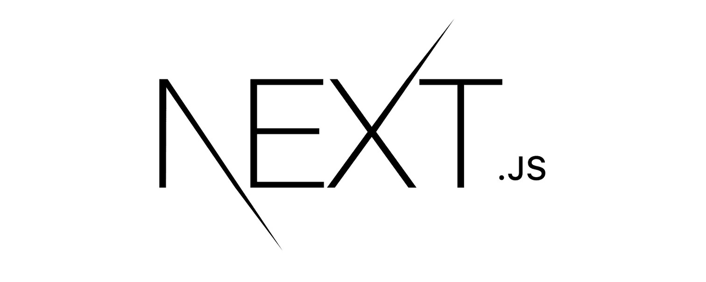
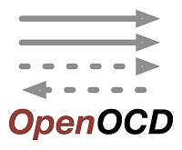
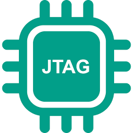
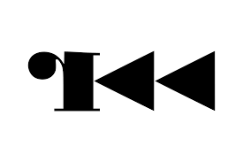
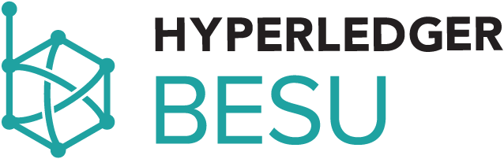
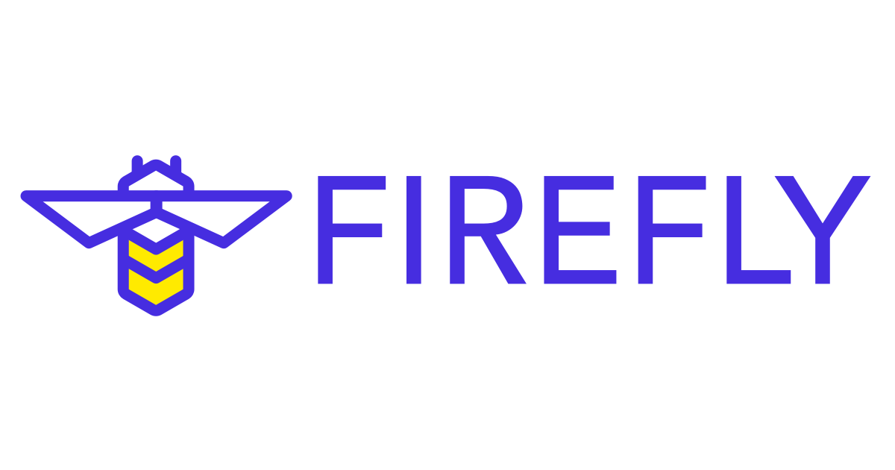
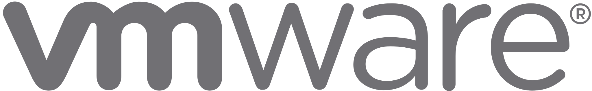

<!-- Header with waving hand -->

<!-- Typing Animation -->

<!-- Break -->
 

<!-- Social badges -->

 

Hi! 👋

I'm a graduate student in Computer Science and i'm studying Cybersecurity at the University of Salerno. My passion lies in the realms of Cybersecurity and IoT. I'm highly determined and endlessly curious, constantly seeking to enhance my skills and knowledge in the field of computer science.

## &#x1f4c8; GitHub Stats

 

    
    
    

 
 

## 💼 Skills

### 🖥️ Programming Languages

  
  
  
  
  
  

### ⚙️ Frameworks & Libraries

  
  
  
  
  
  

### 🗄️ Databases

  
  
  
  
  

### 🔌 Microcontrollers & Embedded Systems

  
  
  
  

### 📡 IoT & Hardware Security

  
  
  
  
  
  
  
  

  <!-- Custom SVG per: Ghidra, JTAG, OpenOCD, AttifyBadge, PUF, TEE, Lightweight Crypto -->

### 🛠️ Development Tools

   
  
  
  
  
  
  
  
  
  
  
  

<!-- Contact and Support -->
## 📧 Contact 

    
Got ideas? Let's collaborate! 🚀 Reach out or fork this project on GitHub to join the journey! ✨

